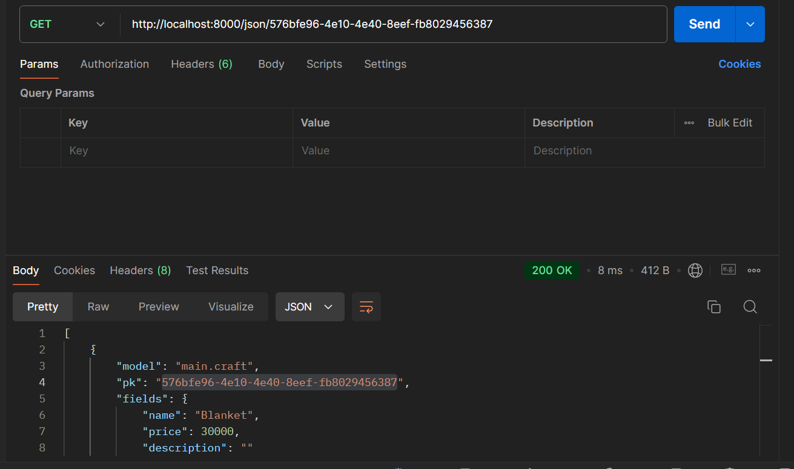

# Craftics Cart

Project Django sederhana dengan tema *e-commerce*, sebagai Tugas Individu Mata Kuliah Pemrograman Berbasis Platform rancangan **Sezza Auraghaniya** dengan NPM **2306207291**.
> **Craftics Cart** adalah aplikasi jual-beli untuk pengrajin atau penggemar produk kerajinan tangan seperti rajutan, *glassware*, hiasan, dan masih banyak lainnya!

## Tugas 2 - Implementasi Model-View-Template (MVT) pada Django

### Membuat sebuah proyek Django baru 
1. Membuat *directory* lokal bernama `craftics-cart`
2. Membuat dan mengaktifkan *virtual environment* dengan perintah:

```bash
python -m venv env
env\Scripts\activate
```

3. Menyiapkan *dependencies* dengan file **requirements.txt** lalu *dependencies* di-install menggunakan perintah:

```bash
pip install -r requirements.txt
```

4. Membuat proyek Django dengan menjalankan perintah startproject di *command prompt*

```bash
django-admin startproject craftics_cart .
```

5. Konfigurasi proyek dengan menambahkan daftar host pada `settings.py` lalu menjalankan server Django dengan command:

```bash
python manage.py runserver
```

6. Inisiasi *directory* lokal ke repositori github dan membuat branch utama dengan *command*:

```bash
git branch -M main
```

dilanjut dengan melakukan git `add`, `commit`, dan `push` ke dalam repositori github.

7. Membuat aplikasi `main` pada proyek

```bash
python manage.py startapp main
```

kemudian menambahkan `main` pada variabel `INSTALLED_APPS`

8. Membuat berkas `main.html` berisikan atribut berupa `name of craft`, `description`, dan `price`.

9. Mendefinisikan model pada `models.py` dengan:

```bash
from django.db import models

class Crafts(models.Model):
    name = models.CharField(max_length=255)
    price = models.IntegerField() 
    description = models.TextField(max_length=2000)
    materials = models.CharField(max_length=255)

    @property
    def is_craft_strong(self):
        return self.craft_intensity > 5
```

10. Migrasi model untuk melacak perubahan pada model basis data.

```bash
python manage.py makemigrations
python manage.py migrate
```

11. Integrasi komponen MVT dengan impor fungsi `render` dari modul `django.shortcuts`, dan menambahkan fungsi `show_main` berisikan atributes

```bash
def show_main(request):
    context = {
        `name_of_craft` : `Crochet Bunny`,
        `description`: `Bunny-shaped crocheted doll`,
        `price`: `65.000`,
        `materials`: `Cotton Wool`
    }

    return render(request, "main.html", context)
```
12. Konfigurasi *routing* URL milik `main` di file `urls.py`

```bash
app_name = `main`

urlpatterns = [
    path(`, show_main, name=`show_main`),
]
```
13. Test final aplikasi pada `localhost` dengan command:

```bash
python manage.py runserver
```
lalu proyek di-*deploy* pada *PWS*

### Django Architecture Diagram

  

Diagram ini mencerminkan hubungan antara berbagai komponen dalam arsitektur Django, di mana views.py menjadi pusat pengolahan yang menghubungkan urls.py, models.py, dan template HTML. Alur kerjanya seperti berikut:

1. User melakukan permintaan (request) melalui URL yang dikonfigurasi dalam `urls.py`.
2. urls.py meneruskan permintaan tersebut ke views.py sesuai dengan view yang dibutuhkan.
3. views.py kemudian melakukan pengolahan, berinteraksi dengan models.py untuk membaca (read) atau menulis (write) data ke database.
4. views.py juga akan merender template (berkas HTML) yang dibutuhkan dengan menggunakan data yang diperoleh dari model.
5. Setelah pengolahan selesai, views.py memberikan respons kembali ke User dalam bentuk halaman web yang sudah di-render.

### Git for Software Development

Git digunakan sebagai sistem kontrol versi yang mengelola perubahan kode, mendukung kolaborasi tim, melacak riwayat, menyelesaikan konflik, dan menjaga keamanan. Git juga memungkinkan *rollback* serta integrasi dengan layanan CI/CD, membuat pengembangan *software* lebih efisien dan terorganisir.

### Pemilihan Django Framework

Berikut adalah alasan memilih Django sebagai *framework* pemula:

1. Django mencakup hampir semua yang dibutuhkan untuk membuat *website*. Mulai dari meng-*handle database* sampai validasi pengguna.

2. Instalasi Django yang hanya membutuhkan **python 3** dan aktivasi *virtual environment* terhitung mudah dari yang lain.

### Django as ORM (Object-Relational Mapping)

Sesuai dengan namanya, ORM berarti pemetaan dari Object-Oriented Programming **(OOP)** ke *relational database*. dengan kata lain, berfungsi untuk menjembatani kedua sistem dan secara otomatik mengonversi data-data di dalamnya.

## Tugas 3 - Implementasi Form dan Data Delivery pada Django

### *Data Delivery* pada Implementasi Platform

Data delivery memungkinkan komunikasi efisien dan pengiriman secara *real-time* antar komponen atau sistem, seperti dari *backend* ke *frontend*

### XML or JSON?

Untuk *website* modern, lebih disarankan penggunaan JSON karena lebih ringan, lebih mudah, dan lebih cepat diproses. 

Namun, XML memiliki kelebihan jika digunakan pada skenario yang lebih kompleks. Seperti data struktur yang *deep* dan dan membutuhkan validasi ketat.

### JSON lebih popular dari XML

Penulisan JSON lebih ringan dengan format yang lebih sederhana. Sehingga lebih mudah dipahami dan mudah di-integrasikan dengan JavaScript. Dimana JavaScript, merupakan bahasa yang banyak digunakan di *front-end*

### Fungsi dari method `is_valid()` pada form Django

`is_valid()` memeriksa apakah data yang dimasukkan ke dalam form sesuai dengan aturan validasi yang ditetapkan. Ketika data valid akan mengembalikan nilai **True**. Tanpa method `is_valid()` kemungkinan input penguna tidak sesuai akan lewat begitu saja.

### `crsf_token` saat Membuat Form di Django

**CRSF** atau Cross-Site Request Forgery, merupakan serangan  dimana penyerang dengan mudah mengirimkan permintaan jahat dari situs lain dengan cara meniru request asli dari aplikasi kita. `crsf_token` adalah untuk Django memverifikasi bahwa permintaan memang berasal dari pengguna dan bukan *source* lain.

### Pembuatan Form dan Data Delivery pada Craftics-Cart!

1. Membuat file `forms.py` untuk inisiasi atribut yang diminta kepada User

2. Membuat fungsi pada `views.py` dalam bentuk XML, JSON, XML by ID, dan JSON by ID.

3. Mmebuat *routing* URL dengan meng-*import* fungsi ke `urls.py` dan menambhahkan path URL ke `urlpatterns`

4. Hasil akses URL pada *Postman*

    - XML
    
    - JSON
    
    - XML by ID
    
    - JSON by ID
    

5. Melakukan `add`, `commit`, dan `push` ke github dan PWS.

## Tugas 4 - Implementasi Autentikasi, *Session*, dan *Cookies* pada Django

### Perbedaan antara `HttpResponseRedirect()` dan `redirect()`

- `HttpResponseRedirect()`: Merupakan kelas di Django yang digunakan untuk membuat respon HTTP yang mengarahkan ulang pengguna ke URL lain. Pada Craftics-Cart! penggunaannya dapat dilihat di potongan kode pada `views.py` 

    ``` bash
        response = HttpResponseRedirect(reverse("main:show_main"))
    ```

- `redirect()`: Ini adalah shortcut yang disediakan Django yang lebih fleksibel dibandingkan `HttpResponseRedirect`. Pada kode bisa memberikan argumen berupa URL, view name, atau objek, dan Django akan mengatur semuanya. Contoh:

    ``` bash
    return redirect('main:login')
    ```

Jadi, perbedaan utamanya adalah `redirect()` lebih sederhana dan fleksibel dibandingkan `HttpResponseRedirect()` karena menggunakan `redirect()` bisa menggunakan view name atau model instance sebagai argumen.

### Menghubungkan Entry dengan User.

- Menambahkan **ForeignKey** pada `models.py`

``` bash
user = models.ForeignKey(User, on_delete=models.CASCADE)
```

- Pada fungsi `create_craft_entry` inisiasikan User dengan User yang sedang *logged-in*

``` bash
raft_entry.user = request.user
```

- pada fungsi `show_main` data yang ditampilkan adalah data pengguna yang sedang *logged_in*

``` bash
 context = {
        ...
        'nama' : request.user.username,
        ...
    }
```

### Authentication dan Authorization

- Authentication *(Autentikasi)*: Proses verifikasi identitas pengguna, biasanya menggunakan username dan password. Ketika pengguna login, mereka memasukkan kredensial yang kemudian diverifikasi untuk memastikan bahwa mereka adalah pengguna terdaftar.

Contohnya berupa metode `login()` dan `authenticate()`:

``` bash  
def login_user(request):
    ...
        if form.is_valid():
            user = form.get_user()
            login(request, user)
            return redirect('main:show_main')
    ...
    return render(request, 'login.html', context)
```

- Authorization *(Otorisasi)*: Proses menentukan hak akses pengguna setelah mereka terverifikasi. Misalnya, setelah login, apakah pengguna memiliki hak untuk mengakses halaman tertentu atau melakukan tindakan tertentu.

Otorisasi dapat diatur menggunakan decorator, seperti:

``` bash
from django.contrib.auth.decorators import login_required

@login_required(login_url='/login')
def show_main(request):
    ...
```

### Session pada Logged-in User dan Cookies

Django mengingat pengguna yang telah login menggunakan session yang disimpan di dalam cookies. Ketika pengguna login:

- Django membuat session ID dan menyimpannya dalam cookie sessionid di browser pengguna.
- Pada setiap permintaan (request) selanjutnya, browser mengirimkan cookie ini sehingga Django dapat mengenali pengguna yang sudah login.

Contoh potongan kode **Cookie** pada project:
``` bash
if form.is_valid():
    user = form.get_user()
    login(request, user)
    response = HttpResponseRedirect(reverse("main:show_main"))
    response.set_cookie('last_login', str(datetime.datetime.now()))
    return response
```

- **Kegunaan lain dari cookies**: Cookies dapat digunakan untuk menyimpan preferensi pengguna, melacak sesi pengguna, atau menyimpan data seperti keranjang belanja.
- **Keamanan cookies**: Tidak semua cookies aman. Cookies harus diatur dengan flag HttpOnly dan Secure untuk mencegah akses JavaScript dan memastikan hanya dikirim melalui koneksi HTTPS. Misalnya:

``` bash
response.set_cookie('last_login', value, httponly=True, secure=True)
```

### Pengerjaan Checklist

1. Akses User ke Aplikasi Django dengan *register, login dan logout*

- Buat form registrasi yang memungkinkan pengguna mendaftarkan akun baru dengan metode `register()`,

``` bash
def register(request):
    form = UserCreationForm()
    if request.method == "POST":
        form = UserCreationForm(request.POST)
        if form.is_valid():
            form.save()
            messages.success(request, 'Your account has been created successfully!')
            return redirect('login')
    context = {'form': form}
    return render(request, 'register.html', context)
```

lalu tambahkan path fungsi ke `urls.py`

``` bash
path('register/', register, name='register'),
```

dan create file `register.html` sebagai tampilannya

- Buat form login untuk memungkinkan pengguna mengakses akun mereka dengan membuat fungsi `login_user()`,

``` bash
def login_user(request):
    if request.method == 'POST':
        form = AuthenticationForm(data=request.POST)
        if form.is_valid():
            user = form.get_user()
            login(request, user)
            return redirect('main')
    else:
        form = AuthenticationForm()
    return render(request, 'login.html', {'form': form})
```

tambahkan path `login_user()` ke `urls.py`;

``` bash
path('login/', login_user, name='login'),
```

lalu buat file `login.html` sebagai tampilan utamanya.

- Implementasikan fungsi logout untuk keluar dari aplikasi dengan membuat fungsi `logout_user()`,

``` bash 
def logout_user(request):
    logout(request)
    return redirect('login')
```

tambahkan path fungsi ke `urls.py`,

``` bash
path('logout/', logout_user, name='logout'),
```

2. Membuat dua akun User yang memiliki tiga dummy data.

    - Membuat dua akun pengguna: Setelah fungsi registrasi berhasil diimplementasikan, buat dua akun pengguna dengan menggunakan form registrasi di halaman aplikasi (misalnya /register).

    - Menambahkan tiga dummy data: Untuk setiap pengguna, tambahkan tiga data menggunakan model yang sudah ada, misalnya `name` atau `description`.

    - contoh:

        
        


3. Menghubungkan model dengan User

    - Untuk menghubungkan model Product dengan User, tambahkan ForeignKey di model Product:

    ``` bash
    class Product(models.Model):
    user = models.ForeignKey(User, on_delete=models.CASCADE)
    name = models.CharField(max_length=100)
    price = models.DecimalField(max_digits=10, decimal_places=2)
    ```

    - Pastikan pengguna yang login dihubungkan saat membuat produk:

    ``` bash
    def create_product(request):
    if request.method == "POST":
        form = ProductForm(request.POST)
        if form.is_valid():
            product = form.save(commit=False)
            product.user = request.user
            product.save()
            return redirect('main')
    else:
        form = ProductForm()
    ```

    - Jika pengguna dihapus, produk terkait juga akan dihapus karena `on_delete=models.CASCADE`.

4. menampilkan atribut User pada aplikasi dan penerapan Cookies

Untuk menampilkan username pengguna yang login, pada view utama `show_main`, ambil informasi dari pengguna yang sedang login dengan menambahkan `request.user.username` ke dalam context seperti berikut:

``` bash
def show_main(request):
    context = {
        'username': request.user.username,
        ...
    }
    return render(request, 'main.html', context)
```

Selain itu, untuk menerapkan cookie `last_login`, tambahkan logika di fungsi `login_user()` untuk menyimpan waktu login terakhir ke dalam cookie dengan menggunakan `response.set_cookie('last_login', str(datetime.datetime.now()))`, seperti pada contoh berikut:

``` bash
def login_user(request):
    i...
        if form.is_valid():
            user = form.get_user()
            login(request, user)
            response = HttpResponseRedirect(reverse('main'))
            response.set_cookie('last_login', str(datetime.datetime.now()))
            ...
    return render(request, 'login.html', {'form': form})
```
Kemudian, di `show_main()`, ambil data dari cookie `last_login` dan tambahkan ke dalam context:

``` bash
...
'username': request.user.username,
        'last_login': last_login,
...
```

Terakhir, inisiasi tampilan pada `main.html`

## Tugas 5: Desain Web menggunakan HTML, CSS dan Framework CSS

### Prioritas Pengambilan CSS *Selector*

Pada CSS, ketika terdapat beberapa selector yang mengatur satu elemen HTML, prioritas pengambilan gaya didasarkan pada tingkat spesifisitas selector tersebut. Berikut urutan prioritasnya:

1. **Inline styles** (gaya langsung dalam elemen HTML) memiliki prioritas tertinggi.
2. **ID selector** (menggunakan tanda #) memiliki spesifisitas lebih tinggi dibanding yang lain.
3. **Class selector** (menggunakan tanda .), **attribute selector**, dan **pseudo-class** memiliki prioritas di bawah ID.
4. **Tag selector** dan **pseudo-element** memiliki prioritas terendah.

Jika dua selector memiliki tingkat spesifisitas yang sama, gaya yang diterapkan terakhir dalam kode CSS akan diambil.

### *Responsive Design*

**Responsive design** penting karena memastikan tampilan dan fungsi situs web tetap optimal di berbagai ukuran layar, dari ponsel hingga desktop. Dengan meningkatnya penggunaan perangkat mobile, penerapan responsive design sangat diperlukan agar pengguna mendapatkan pengalaman yang baik, tanpa harus melakukan zoom atau scroll berlebihan. 

Contoh aplikasi yang sudah menerapkan responsive design adalah platform e-commerce seperti Tokopedia, yang tampak rapi di layar kecil. Sedangkan, aplikasi lama tanpa responsive design sering memerlukan zoom manual pada ponsel untuk melihat konten dengan jelas.

### Margin, Border, and Padding.

| **Aspek**            | **Penjelasan**                                                                 | **Efek Terhadap Layout**                                                                 |
|----------------------|--------------------------------------------------------------------------------|------------------------------------------------------------------------------------------|
| **Margin**           | Jarak luar antara elemen dan elemen lain di luar elemen tersebut.               | Menambah jarak antar elemen di luar elemen tersebut.                                      |
| **Border**           | Garis yang mengelilingi konten dan padding dari elemen.                         | Tidak mempengaruhi ukuran konten, tetapi menambah ketebalan elemen secara visual.         |
| **Padding**          | Jarak antara konten dan batas (border) dari elemen.                             | Mendorong konten menjauh dari border, memperluas elemen secara internal.                 |
| **Content**          | Isi dari elemen itu sendiri, misalnya teks atau gambar.                         | Elemen inti yang ditampilkan, pengubahannya mengubah tampilan langsung.                  |
| **Background Color** | Warna latar belakang elemen yang berada di bawah konten dan padding.            | Mengubah tampilan visual keseluruhan elemen, meskipun tidak mempengaruhi layout langsung. |

### Flex Box dan Grid Layout

Flexbox dan Grid Layout adalah dua sistem tata letak (layout) modern dalam CSS yang digunakan untuk mengatur elemen di halaman web dengan cara yang lebih fleksibel dan responsif.

- Flexbox (Flexible Box Layout):
    - Flexbox berfokus pada pengaturan elemen dalam satu dimensi, baik secara horizontal (baris) atau vertikal (kolom).
    - Penggunaannya ideal untuk membuat tata letak yang fleksibel, seperti menyusun elemen secara berurutan dan mendistribusikan ruang di antara atau di sekitar elemen.
    - Kelebihannya adalah penyesuaian elemen bisa dilakukan secara otomatis sesuai ukuran kontainer atau layar.
    - Contoh penggunaan: Membuat navbar atau galeri gambar yang elemen-elemennya bisa beradaptasi dengan lebar layar.

- Grid Layout:
    - Grid bekerja dalam dua dimensi, yaitu baris dan kolom, yang memungkinkan tata letak elemen lebih kompleks.
    - Dengan Grid, Anda dapat membagi halaman menjadi beberapa bagian (area) dan menempatkan elemen dalam berbagai kombinasi baris dan kolom.
    - Kelebihannya adalah kontrol penuh atas tata letak dua dimensi, yang lebih cocok untuk desain halaman yang membutuhkan struktur area yang lebih terperinci.
    - Contoh penggunaan: Membuat tata letak halaman web yang memiliki bagian header, sidebar, konten utama, dan footer.

- Kegunaan:

    1. Flexbox lebih efisien untuk tata letak sederhana yang memerlukan penyesuaian satu dimensi.
    2. Grid Layout lebih cocok untuk tata letak halaman yang lebih kompleks dengan penempatan elemen dalam bentuk baris dan kolom.
    
Dengan kombinasi kedua konsep ini, desainer web bisa menciptakan tata letak yang responsif dan fleksibel untuk berbagai ukuran layar.

### Implementasi Checklist

1. Implementasikan fungsi untuk menghapus dan mengedit *product*.

    - Menambahkan fungsi `edit_craft` dan ` delete_craft` pada `views.py` 

    ``` bash
    def edit_craft(request, id):
    # Get craft entry berdasarkan id
    craft = craftEntry.objects.get(pk = id)

    # Set craft entry sebagai instance dari form
    form = craftEntryForm(request.POST or None, instance=craft)

    if form.is_valid() and request.method == "POST":
        # Simpan form dan kembali ke halaman awal
        form.save()
        return HttpResponseRedirect(reverse('main:show_main'))

    context = {'form': form}
    return render(request, "edit_craft.html", context)
    ```

    ``` bash 
    def delete_craft(request, id):
    # Get craft berdasarkan id
    craft = craftEntry.objects.get(pk = id)
    # Hapus craft
    craft.delete()
    # Kembali ke halaman awal
    return HttpResponseRedirect(reverse('main:show_main'))
    ```

    - import method ke `urls.py` lalu tambahkan *path url* ke `urlpatterns`

    - menambahkan button **edit** dan **delete** pada `main.html`

2. Kustomisasi halaman daftar product menjadi lebih menarik dan responsive.
    
    - Kondisi ketika belum ada produk : menggunakan kode ``
    - Menambahkan detail product menggunakan **card** : kode akan memasuki kondisi ``, lalu menampilkan produk yang ada dengan memanfaatkan `card_craft.html`

3. Membuat Button!
    - Memanfaatkan method `edit_craft` dan `delete_craft` pada `views.py`

    - Pastikan bahwa setelah membuat button, akan ada yang redirect ke page untuk **delete** atau **edit**

    - Buat html file (`edit_craft.html`) dan tampilkan nama produk dan fields yang ingin diubah

    - Untuk button delete, akan terlihat pada main.html yang sudah ditambahkan kode button.


4. Navigation Bar!
    - Membuat file html untuk fitur navigation bar
    - menambahkan potongan kode `` untuk *link* html ke html-html lainnya

## Tugas 6: JavaScript dan AJAX
###  JavaScript dalam Pengembangan Aplikasi Web
- **Interaktivitas:** JavaScript memungkinkan pengembang untuk membuat elemen halaman web yang interaktif, seperti formulir dinamis, animasi, dan elemen responsif tanpa harus memuat ulang seluruh halaman.
- **Responsivitas:** Dengan JavaScript, aplikasi web dapat merespons tindakan pengguna secara instan, seperti mengubah konten halaman secara real-time (misalnya, menambahkan item ke keranjang belanja atau menampilkan data baru).
- **Komunikasi Asinkron:** JavaScript memungkinkan komunikasi asinkron antara browser dan server menggunakan AJAX (Asynchronous JavaScript and XML), sehingga pengguna tidak harus menunggu halaman dimuat ulang untuk mendapatkan data baru dari server.
- **Pengalaman Pengguna yang Lebih Baik:** Dengan JavaScript, aplikasi web dapat memberikan pengalaman pengguna yang lebih mulus dan cepat dengan memproses sebagian besar interaksi di sisi klien tanpa mengganggu keseluruhan aplikasi.

### Fungsi `await` dan `fetch()`

`await` digunakan untuk menunggu hasil dari operasi asinkron sebelum melanjutkan eksekusi kode. Dalam konteks `fetch()`, `await` akan menunggu hingga permintaan ke server selesai dan responsnya tersedia.

Jika tidak menggunakan `await`, fungsi `fetch()` akan mengembalikan promise yang belum selesai. Kode berikutnya akan berjalan sebelum respons diterima, sehingga Anda tidak akan bisa mengakses data yang diambil dari server. Sebagai contoh, jika Anda tidak menggunakan `await`, Anda mungkin akan mencoba menggunakan data yang belum tersedia, yang bisa menghasilkan kesalahan atau hasil yang tidak diinginkan.

Misalkan pada,

``` bash
const response = await fetch('/some-url');  // Menunggu respons selesai
const data = await response.json();  // Menunggu parsing JSON selesai
```

Jika tidak menggunakan `await`, kode berikutnya akan berjalan tanpa menunggu:

``` bash
const response = fetch('/some-url');  // Ini masih promise, belum ada respons
const data = response.json();  // Akan gagal, karena respons belum ada
```

### Mengapa Perlu Menggunakan Decorator `csrf_exempt` pada View untuk AJAX POST

- CSRF (Cross-Site Request Forgery) adalah serangan di mana permintaan tidak sah dilakukan dari pengguna yang sah ke server. Django secara otomatis melindungi aplikasi dari serangan ini dengan menggunakan token CSRF pada setiap permintaan POST.

- Jika kita menggunakan AJAX POST tanpa mengirimkan token CSRF, Django akan memblokir permintaan tersebut. Decorator csrf_exempt digunakan untuk menonaktifkan pengecekan token CSRF pada view tertentu yang digunakan untuk menerima permintaan POST dari AJAX. Namun, ini berpotensi membuka celah keamanan jika tidak diterapkan dengan hati-hati.

Idealnya, kita harus tetap menyertakan CSRF token dalam AJAX request daripada menonaktifkan CSRF sepenuhnya.

### Mengapa Pembersihan Data Input Pengguna Dilakukan di Backend juga?

- Keamanan: Validasi dan pembersihan data di backend sangat penting karena pengguna dapat memodifikasi kode frontend seperti JavaScript atau HTML sebelum mengirim data ke server. Data yang diterima dari pengguna harus selalu dianggap tidak dapat dipercaya.

- Konsistensi: Validasi di backend memastikan bahwa aturan validasi diterapkan secara konsisten dan tidak hanya bergantung pada kode frontend, yang mungkin dimodifikasi atau dilewati oleh pengguna.

- Menghindari Serangan: Backend melindungi dari serangan injeksi (seperti SQL Injection atau XSS) dengan membersihkan dan memvalidasi data input pengguna sebelum menyimpannya ke database atau menampilkannya kembali.

    **Mengapa tidak hanya di frontend:** Karena pengguna dapat mematikan atau mengabaikan validasi di frontend, backend harus tetap melakukan validasi sebagai pertahanan terakhir.

### Pengerjaan Checklist

1. Membuat Form untuk Input Data
Membuat form HTML untuk menangani input dari pengguna yang mencakup name, description, price, dan image_url. Form ini digunakan untuk menambah entri baru melalui AJAX.

``` bash
html
Copy code
<form id="craftEntryForm">
    <input type="text" id="name" name="name" placeholder="Enter craft name" required>
    <textarea id="description" name="description" placeholder="Describe the craft" required></textarea>
    <input type="number" id="price" name="price" required>
    <input type="url" id="image_url" name="image_url" placeholder="Image URL">
</form>
```

2. Menambahkan AJAX untuk Submit Form
Menggunakan AJAX dengan fetch untuk menangani pengiriman form secara asinkron tanpa perlu refresh halaman.

``` bash
javascript
Copy code
function addCraftEntry() {
    fetch("", {
        method: "POST",
        body: new FormData(document.querySelector('#craftEntryForm')),
    })
    .then(response => refreshCraftEntries());
    document.getElementById("craftEntryForm").reset();
    hideModal();
}
```

3. Menambahkan Validasi di Backend
menggunakan Django views untuk memproses data yang dikirimkan oleh pengguna dan membersihkan input menggunakan strip_tags.

``` bash
python
Copy code
from django.utils.html import strip_tags

def add_craft_entry_ajax(request):
    name = strip_tags(request.POST.get('name'))
    description = strip_tags(request.POST.get('description'))
```

4. Menambahkan Token CSRF
Untuk keamanan, menambahkan token CSRF ke permintaan AJAX agar permintaan POST dilindungi dari serangan CSRF.

``` bash
javascript
Copy code
const csrftoken = getCookie('csrftoken');
fetch("", {
    method: "POST",
    headers: {'X-CSRFToken': csrftoken},
    body: new FormData(document.querySelector('#craftEntryForm')),
});
```

5. Menampilkan Data Secara Dinamis
Setelah data ditambahkan, mengambil ulang entri terbaru dan menampilkan dalam halaman tanpa perlu reload menggunakan AJAX.

``` bash
javascript
Copy code
async function refreshCraftEntries() {
    const craftEntries = await getCraftEntries();
    // Generate HTML untuk tiap item dan tampilkan
}
```
